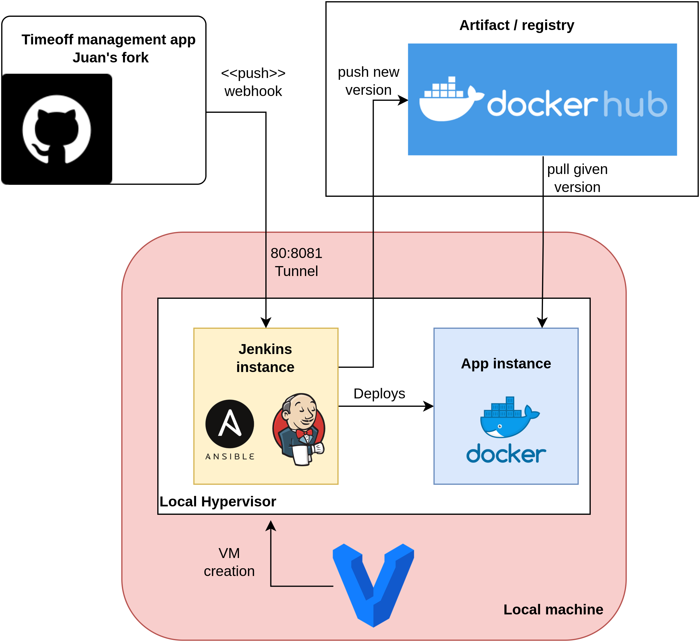

# Timeoff Vagrant Automation
Automation for deployment of time-off management application using Vagrant and Ansible

---
## Architecture


## Requirements  
- Virtual Box (or with minor changes any other supported type 2 hypervisor)
- Vagrant >= 2.2.19
- ~3gb of available RAM memory

## Deployment steps
```
cd timeoff-vagrant-automation
vagrant up
```

This will deploy the infrastructure components described above and provision all necessary configuration to ensure the CI/CD process, creating a developer-ready environment of the application, it includes:

- Start up on Virtual machines.
- NAT and other networking configurations
- Software base installation (docker and other dependencies).
- Jenkins installation.
- Jenkins plugins.
- Creation of pipeline job and secrets on Jenkins.
- Application deployment.

The latest version of the application is deployed at the first start,  available on https://localhost:8080.

After that, the Jenkins server exposed at http://localhost:8081 contains a job pipeline that deploys the latest version of the application using the source code from https://github.com/jarcil13/timeoff-management-application.

Given that the current deployment environment is a local machine without access to a public IP, a tunneling service is used to expose the local port of Jenkins. Following this steps: 

Using [Localtunnel](https://localtunnel.github.io/www/)
```
lt -s automation-jdarcilam --port 8081
```

This will allow connections from GitHub to the deployed Jenkins server. An automatic pipeline trigger is configured using a webhook integration on the forked application repository. 

